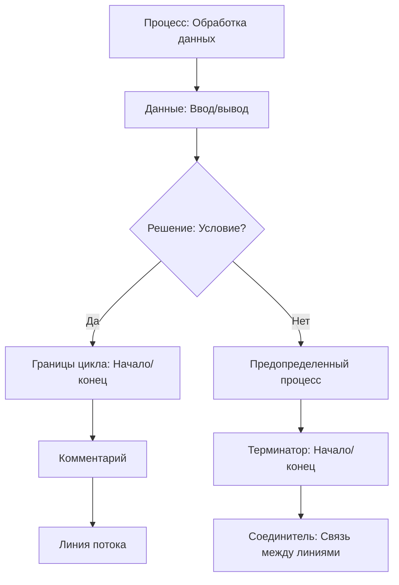

Графическое изображение блок-схемы

| № п/п | Графическое изображение элемента                             | Описание элемента                                            |
| ----- | ------------------------------------------------------------ | ------------------------------------------------------------ |
| 1     |  | Процесс - блок обработки данных, в котором указываются действия, изменяющие значение, форму представления или расположение данных. |
| 2     |  | Данные – блок описания операции ввода/вывода данных, для которой не определено конкретное устройство. |
| 3     |  | Решение – блок выбора направления выполнения алгоритма в зависимости от некоторых условий. В результате проверки условия осуществляется выбор одного из нескольких возможных путей. |
| 4     |  | Границы цикла - символ состоит из двух частей и определяет начало и конец цикла. |
| 5     |  | Предопределенный процесс – блок описания процесса из одной или нескольких операций, описанных в отдельном модуле (самостоятельном алгоритме). |
| 6     |  | Комментарий – содержит пояснение функции блока, с которым связан. |
| 7     |  | Терминатор – обозначает начало и конец алгоритма.            |
| 8     |  | Линия потока – отображает потоки данных и управления в алгоритме. |
| 9     |  | Соединитель – указание связи между прерванными линиями потока, связывающими блоки. |

Линейный Ветвящийся и Циклический алгоритмы

-  Линейный алгоритм: последовательное выполнение блоков.  
- Ветвящийся алгоритм: выбор направления выполнения в зависимости от условий.  
- Циклический алгоритм: повторение блока или процесса определенное количество раз.

`